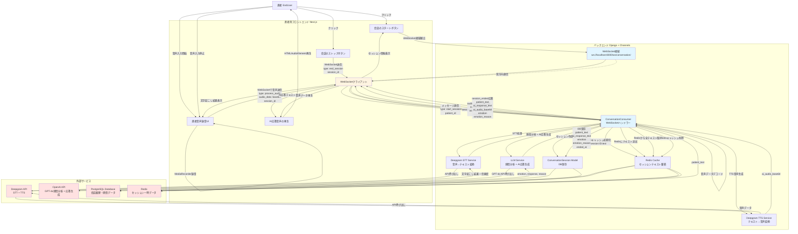

# 患者の通信フロー（現在の実装）



## 主要な変更点

### 1. **WebSocket通信方式**
- 従来の設計: REST API + ポーリング
- 現在の実装: **WebSocket双方向通信** (`ws://localhost:8000/ws/conversation/`)
- 利点: リアルタイム通信、低レイテンシ、サーバープッシュ可能

### 2. **メッセージタイプ**
WebSocketで送受信される3つのメッセージタイプ:

#### 送信メッセージ
1. `start_session` - セッション開始
2. `process_audio` - 音声データ送信（STT処理）
3. `end_session` - セッション終了（LLM + TTS処理）

#### 受信メッセージ
1. `connection_established` - 接続確立
2. `session_started` - セッション開始完了
3. `audio_processed` - 音声処理完了（文字起こし結果）
4. `session_ended` - セッション終了完了（AI応答 + 音声）
5. `error` - エラー発生

### 3. **データフロー**

#### セッション開始
```
患者 → start_session(patient_id) → ConversationConsumer
→ DB: ConversationSession作成
→ Redis: session:{id}:text 初期化
→ session_started応答
```

#### 音声処理（繰り返し可能）
```
患者 → process_audio(session_id, audio_data) → ConversationConsumer
→ Deepgram STT API
→ Redis: テキスト蓄積
→ audio_processed応答(transcribed_text, accumulated_text)
```

#### セッション終了
```
患者 → end_session(session_id) → ConversationConsumer
→ Redis: 蓄積テキスト取得
→ OpenAI GPT-4o: 感情分析 + AI応答生成
→ Deepgram TTS API: 音声生成
→ DB: 会話履歴保存
→ Redis: キャッシュ削除
→ session_ended応答(ai_response_text, ai_audio_base64, emotion)
```

### 4. **外部API統合**

| サービス | 用途 | タイミング |
|---------|------|-----------|
| Deepgram STT | 音声→テキスト | 音声送信時（process_audio） |
| Deepgram TTS | テキスト→音声 | セッション終了時（end_session） |
| OpenAI GPT-4o | 感情分析 + AI応答生成 | セッション終了時（end_session） |

### 5. **データベース構造**

#### ConversationSession Model
```python
- id: UUID
- patient: ForeignKey(Patient)
- started_at: DateTime
- ended_at: DateTime (nullable)
- patient_text: Text (会話全文)
- ai_response_text: Text
- emotion: ForeignKey(Emotion)
- emotion_reason: Text
- is_active: Boolean (ended_at == None)
```

### 6. **Redis使用**
- キー: `session:{session_id}:text`
- 値: 蓄積されたテキスト（スペース区切り）
- TTL: 3600秒（1時間）
- 目的: 複数の音声チャンクを1つのセッションにまとめる

### 7. **フロントエンド実装**
- ファイル: `/front/src/app/test-conversation/page.tsx`
- 技術: Next.js 15 + WebSocket API
- 音声録音: MediaRecorder API
- 音声再生: HTMLAudioElement
- 認証: localStorage (token, patientId, patientName)

### 8. **認証フロー**
```
患者 → /login → 認証成功
→ localStorage保存(token, patientId, patientName)
→ /test-conversation
→ WebSocket接続（認証情報なし、今後実装予定）
```
